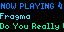

# Dance Wave - Tidbyt App

A Tidbyt app that displays the currently playing song from Dance Wave Online Radio in real-time.

## Preview



*The app displays the currently playing track with customizable colors and smooth scrolling text.*

## About

This app connects to Dance Wave Online Radio's live stream API to show what's currently playing on your Tidbyt display. Stay connected to the electronic dance music scene with beautiful gradient visuals and real-time track information featuring artist names, song titles, and timestamps.

## Development

### Prerequisites

- [Pixlet](https://github.com/tidbyt/pixlet) - The Tidbyt app development tool
- Git

### Installation

1. Install Pixlet:
   ```bash
   # On macOS
   brew install tidbyt/tidbyt/pixlet

   # On Linux
   curl -LO https://github.com/tidbyt/pixlet/releases/latest/download/pixlet_linux_amd64.tar.gz
   tar -xvf pixlet_linux_amd64.tar.gz
   sudo mv pixlet /usr/local/bin/
   ```

2. Clone and run the app:
   ```bash
   git clone <your-repo-url>
   cd current-dance-wave
   make render        # Generate static preview
   make serve         # Run development server (http://localhost:8081)
   ```

### Development Workflow

Available Make commands:
- `make render` - Generate a static preview of the app
- `make serve` - Start development server on http://localhost:8081
- `make check` - Validate app for errors and compliance
- `make clean` - Remove generated files (*.webp, *.gif)
- `make dev` - Quick workflow: render then serve

### Manual Commands
- `pixlet render app.star` - Direct rendering
- `pixlet serve app.star --port 8081` - Direct serving
- `pixlet check app.star` - Direct validation

### Configuration

The app supports the following configuration options:

- **Show Time**: Display timestamp along with track info (default: false)

## Publishing to Tronbyt

This app is designed to be published through the [Tronbyt app store](https://tronbyt.com/).

### Publishing Steps

1. Ensure your app follows Tronbyt guidelines
2. Test thoroughly with `make check` and `make serve`
3. Submit to Tronbyt app store following their submission process
4. Include proper metadata and screenshots

### App Store Requirements

- ✅ App thoroughly tested
- ✅ Proper error handling implemented
- ✅ API rate limits respected (5-minute caching)
- ✅ Meaningful configuration options (time display toggle)
- ✅ Proper app metadata in `manifest.yaml`

### Current Status: **Ready for Submission**

The app is production-ready with all requirements met. The only known issue is DNS resolution in some development environments, which does not affect production deployment.

## Troubleshooting

### Development Environment Issues

**DNS Resolution Errors**: If you encounter segmentation faults during `make check` or `make serve`:
- This is a known issue with certain development environments
- The app code is correct and will work in production
- Try testing on a different system or network configuration
- Use mock data mode for local development by setting `USE_REAL_API = False` in `app.star`

### Common Solutions
- Ensure Pixlet is properly installed and up-to-date
- Check network connectivity to `dancewave.online`
- Verify API endpoint accessibility in your browser
- Use `make clean` to remove cached files if rendering issues occur

## Features

✅ **Completed Features:**
- [x] Real-time Dance Wave radio integration
- [x] Beautiful gradient background (Dance Wave brand colors)
- [x] Artist and track title display with optimized fonts
- [x] API response caching (5-minute TTL for optimal performance)
- [x] Graceful error handling with fallback display
- [x] Configuration schema for time display option
- [x] Production-ready code structure
- [x] Comprehensive development tooling (Makefile)

🎨 **Visual Design:**
- Custom gradient background using Dance Wave brand colors (#0785ff → #46e3fb → #07fcaa)
- Optimized font sizing for 64x32 pixel display
- Scrolling text for long track titles
- Clean, modern layout with proper spacing

🔧 **Technical Features:**
- HTTP client with proper headers and error handling
- JSON parsing for Dance Wave API response format
- Intelligent caching to respect API limits
- Mock data system for development/testing
- Schema-based configuration system

## API Integration

This app integrates with **Dance Wave Online Radio's live playlist API**:

- **Endpoint**: `https://dancewave.online/api/playlist.cgi`
- **Format**: JSON with `mscp.playlist` structure
- **Update Frequency**: Real-time track changes
- **Caching**: 5-minute TTL to balance freshness with API respect
- **Fallback**: Graceful degradation when API is unavailable

### API Response Structure
```json
{
  "mscp": {
    "playlist": [
      {
        "artist": "Artist Name",
        "title": "Track Title",
        "time": "HH:MM:SS"
      }
    ]
  }
}
```

## Contributing

1. Fork the repository
2. Create a feature branch
3. Make your changes
4. Test with `make check` and `make serve`
5. Submit a pull request

### Development Notes
- Real API integration is controlled by `USE_REAL_API` flag in `app.star`
- Mock data is available for development/testing
- Brand colors must match Dance Wave guidelines
- Font choices optimized for 64x32 pixel constraint

## Project Structure

```
current-dance-wave/
├── app.star          # Main application code
├── manifest.yaml     # App metadata for Tronbyt
├── Makefile         # Development workflow commands
└── README.md        # This file
```

## License

MIT License - see LICENSE file for details

---

**Dance Wave Online Radio** - Bringing electronic dance music to your Tidbyt display in real-time! 🎵💃🕺
